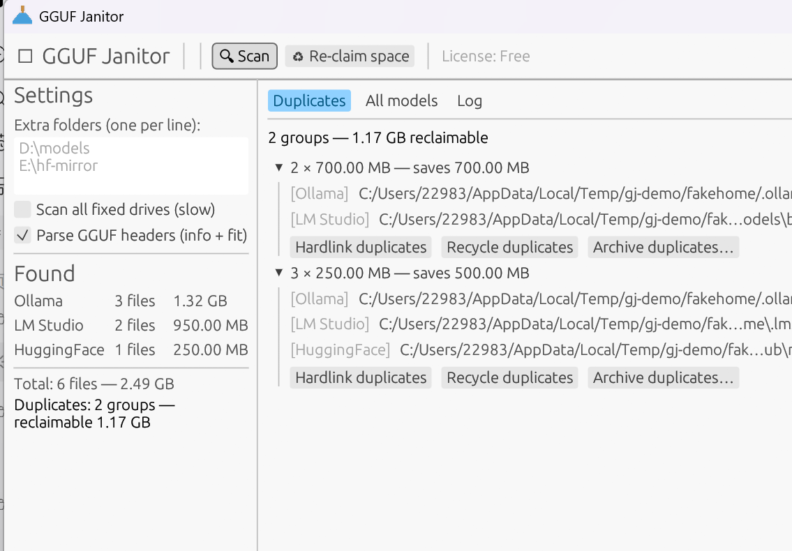

# 🧹 GGUF Janitor

**Stop wasting disk on duplicate local LLM models.**

GGUF Janitor scans your Windows machine for local model files (GGUF) across
**Ollama, LM Studio, HuggingFace and any custom folders**, finds
content-identical duplicates, and reclaims space **safely** — via NTFS
hardlinks (every tool keeps seeing "its" file), the Recycle Bin, or
hash-verified archive moves. It also estimates whether each model fits your
RAM / VRAM.

> Every tool downloads its own copy: LM Studio, Ollama and llama.cpp each keep
> a private model store. One 8 GB model × 3 tools = **24 GB gone**. GGUF
> Janitor fixes that — without breaking any of them.



## Why it's safe

Reclaiming space from files that other programs manage is risky, so GGUF
Janitor is paranoid by design:

1. **Two-stage identity check** — files are only considered duplicates when
   their sizes match, their full-streamed XXH3-64 hashes match, *and* the
   first and last 4 KiB are byte-identical.
2. **Re-verified before every action** — content is re-checked immediately
   before a hardlink swap; if anything changed or is unreadable, the file is
   skipped.
3. **Hardlinks, not deletions** (default) — all copies stay visible to every
   tool; the disk simply stores one physical copy. Ollama, LM Studio and
   llama.cpp keep working untouched.
4. **Recycle Bin only** — the delete action never permanently erases.
5. **Archive moves are hash-verified** — cross-volume moves copy, verify the
   full hash, and only then remove the original; an undo manifest
   (`gguf-janitor-archive.jsonl`) is written next to the archive.
6. **Dry-run first** — `dedupe --dry-run` shows exactly what would happen.
   In-use / locked files are detected and skipped automatically.

## Features

- 🔍 **Automatic store discovery** — Ollama blobs (with model tags from
  manifests, e.g. `llama3:8b`), LM Studio model folders, HuggingFace cache,
  plus any custom folders or full-drive scan for loose `.gguf` files.
- 🧾 **GGUF parsing** — model name, architecture, quantization, parameter
  count, tensor count, context length. Streaming parser: multi-GB files are
  summarized without loading them. Split/sharded GGUFs (`-00001-of-…`) are
  grouped and never false-positive as internal duplicates.
- 🔗 **Hardlink dedupe** — same-volume duplicates collapse onto one physical
  copy with one click.
- 🚏 **Fit check** — per-model run-footprint estimate (weights + KV cache at
  a chosen context + overhead) vs your detected RAM and VRAM (nvidia-smi).
- 🗂 **Three reclaim modes** — hardlink, Recycle Bin, verified archive move.
- 🖥 **GUI + CLI** — a single-file GUI app for everyday use, and a scriptable
  CLI (`scan --json`, `dedupe --yes`) for automation.

## Install

**Portable (recommended):** download `gguf-janitor-<version>-windows-x64.zip`
from [Releases](https://github.com/cp3wangyue/gguf-janitor/releases), unzip,
run `gguf-janitor.exe`. No installer, no admin rights, no runtime
dependencies. Works on Windows 10/11 x64.

**Uninstall:** delete the folder. That's it — GGUF Janitor writes nothing
outside its own folder except an optional license file
(`%APPDATA%\GGUFJanitor\license.key`) and archive manifests next to the
archive folders you choose.

## Usage

No arguments → GUI:

```
gguf-janitor.exe
```

CLI:

```bat
:: inventory every known store (read-only)
gguf-janitor scan

:: machine-readable report
gguf-janitor scan --json

:: what duplicates exist? (also scans extra folders)
gguf-janitor dedupe --paths D:\models,E:\hf-mirror --dry-run

:: collapse duplicates onto hardlinks (one physical copy, all tools keep working)
gguf-janitor dedupe --paths D:\models --yes

:: or move duplicates to the Recycle Bin / an archive drive
gguf-janitor dedupe --mode recycle --yes
gguf-janitor dedupe --mode archive --dest E:\model-archive --yes

:: inspect a model
gguf-janitor info Qwen3-27B-Q4_K_M.gguf

:: will it fit? (detects RAM and VRAM automatically)
gguf-janitor fit Qwen3-27B-Q4_K_M.gguf --context 32768
```

Notes:

- Cross-volume hardlinks are physically impossible (NTFS rule); those groups
  are reported and can be reclaimed with `--mode archive` or `--mode recycle`.
- Split GGUF shards are never "deduplicated" against each other.
- Files currently in use by a local inference server are skipped.

## Free vs Pro

| | Free | Pro |
|---|---|---|
| Scan, store report, GGUF info, fit check | unlimited | unlimited |
| Dedupe / archive / recycle, per file size | ≤ 1 GiB | unlimited |
| Price | €0 | **€14.99** one-time |

The free tier already covers most small/medium quantized models. A license
unlocks dedupe of arbitrarily large models (70B+ quants, FP16 shards…).
Activate from a terminal:

```
gguf-janitor activate GJ-XXXX-XXXX-XXXX-XXXX
```

Licenses are verified fully offline; buy once, keep forever. (See
`docs/BUYING.md` for the current purchase link.)

## Building from source

```
cargo test        # 30 unit tests
cargo build --release
```

Requirements: Rust stable (MSVC toolchain), Windows 10/11. The GUI is
[egui](https://github.com/emilk/egui); there are no other system
dependencies.

## FAQ

**Is a hardlink safe if two tools "modify" the model file?**
Inference tools only read model files. If any tool did write, both names
would see the same bytes — which is exactly what a normal copy would do
anyway. Nothing in your model store is written by GGUF Janitor without a
hash re-verification.

**Why 64-bit hashes — is that enough?**
The hash is a pre-filter; the head+tail byte comparison is the gate before
any action. For content written once and never modified, the combination has
no realistic false-positive path: a group must match in size, full XXH3, and
head/tail bytes.

**Does it work with LM Studio's new `.lmstudio` layout and the old
`.cache/lm-studio` one?**
Both, and with the `OLLAMA_MODELS` / `HF_HUB_CACHE` environment overrides.

**Something went wrong — how do I undo a hardlink?**
A hardlink is only a second name for the same file; to "undo", copy the file
back to any location (`copy` in Explorer). No data was ever shared across
volumes, and no original was deleted.

## Status & roadmap

- v0.1.0 — scan, dedupe (hardlink/recycle/archive), fit check, GUI+CLI.
- Planned: safetensors support, `--move-to-store` (adopt loose files into a
  canonical shared store), multi-drive auto-archive balancing, scheduling.

## License

MIT — see [LICENSE](LICENSE).
